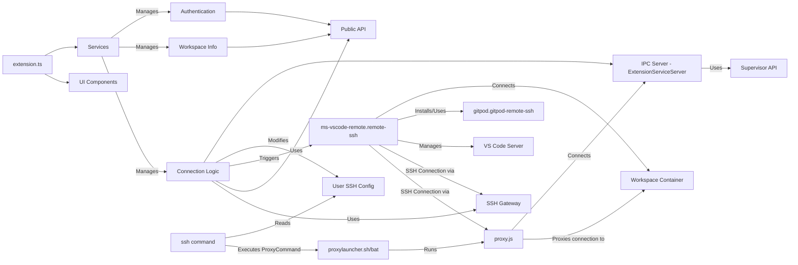

# System Patterns

*This file documents the system architecture, key technical decisions, design patterns in use, component relationships, and critical implementation paths.*

## System Architecture

This is a VS Code Extension (`extensionKind: ["ui"]`) designed to bridge VS Code Desktop with Gitpod Classic workspaces. Its architecture revolves around:

1.  **VS Code API Integration:** Heavily utilizes core VS Code APIs for UI (Activity Bar, Views, Commands, Status Bar, Notifications), Authentication, Configuration, File System access, Logging, and Remote Development hooks (`onResolveRemoteAuthority`, `vscode.openFolder`).
2.  **Service Layer:** A set of services (`*Service.ts`) encapsulate distinct functionalities like session management, host configuration, remote connection logic, telemetry, notifications, and logging.
3.  **Dual Connection Strategy:** Implements two methods for establishing SSH connections:
    *   **Local SSH Proxy:** Modifies the user's SSH configuration (`~/.ssh/config`) to use a `ProxyCommand`. This command executes a helper Node.js script (`proxy.js`) which communicates back to the main extension via an IPC channel (`ExtensionServiceServer`) to retrieve authentication details (including temporary SSH keys fetched from the Gitpod Supervisor API) before establishing the connection (likely over a WebSocket).
    *   **SSH Gateway:** Connects directly to Gitpod's SSH endpoint, authenticating using user-provided SSH keys (verified via Gitpod API) or a temporary `ownerToken` (obtained via Gitpod API) used as a password.
4.  **External Dependencies:**
    *   **Gitpod APIs:** Interacts with the Gitpod Public API (for workspace management, user keys) and the Gitpod Supervisor API (within the workspace, via the local proxy, to generate temporary SSH keys).
    *   **`ms-vscode-remote.remote-ssh`:** Relies entirely on this built-in VS Code extension to handle the final SSH connection establishment and remote session management once the connection parameters are determined.
    *   **`gitpod.gitpod-remote-ssh`:** A companion extension that this extension ensures is installed *within* the remote Gitpod workspace, likely for post-connection setup or features.
    *   **Local SSH Client:** Leverages the user's installed SSH client via configuration modifications for the Local Proxy method.
5.  **IPC:** Uses a gRPC/ConnectRPC-based IPC mechanism (`ExtensionServiceServer`) for communication between the main extension process and the `proxy.js` script executed by the SSH client.

## Key Technical Decisions

- **Leverage Native Remote-SSH:** Instead of implementing a full SSH client and remote file system provider, delegate the core remote connection handling to the mature `ms-vscode-remote.remote-ssh` extension. This significantly reduces complexity.
- **Dual Connection Methods:** Provide both a direct SSH gateway method (more standard but potentially blocked) and a local proxy method (more complex setup but potentially bypasses firewall issues and uses temporary keys).
- **IPC for Proxy Authentication:** Use an IPC server within the extension to securely pass sensitive information (like API tokens or temporary SSH keys) to the `proxy.js` script, avoiding the need to store them insecurely or pass them via command-line arguments.
- **Modify Global SSH Config:** Directly modify the user's `~/.ssh/config` (via an included file) to integrate the `ProxyCommand` needed for the local proxy method. This requires careful handling but enables seamless integration with the native SSH client.
- **Use Supervisor API for Temporary Keys:** For the local proxy method, interact with the Supervisor API within the target workspace (via the owner token initially) to generate a temporary SSH key pair (`createSSHKeyPair`). This avoids relying solely on user-managed keys for this path.
- **Feature Flag for Local Proxy:** Introduce the local proxy mechanism behind an experimental flag (`ExperimentalSettings`), allowing for gradual rollout and testing.
- **Companion Remote Extension:** Require `gitpod.gitpod-remote-ssh` on the remote side, suggesting some functionality is better handled within the remote context after connection.

## Design Patterns

- **Service Locator / Dependency Injection:** Services are instantiated in `extension.ts` and passed down to components that need them (e.g., `RemoteConnector` receives `SessionService`, `HostService`, etc.).
- **Disposable Pattern:** Classes extend `Disposable` and register resources (event listeners, servers, etc.) using `_register` for cleanup in the `dispose` method.
- **Command Pattern:** Commands are encapsulated in classes (e.g., `SignInCommand`) registered with a `CommandManager`.
- **Asynchronous Programming:** Extensive use of `async`/`await` and `Promise`s for handling I/O operations (API calls, file system access, IPC).
- **Observer Pattern:** Use of `vscode.EventEmitter` and `onDidChange*` events (e.g., `hostService.onDidChangeHost`).
- **gRPC/ConnectRPC:** Used for defining and implementing the IPC service (`ExtensionServiceDefinition`).

## Component Relationships

- **`extension.ts`:** Orchestrates activation, initializes all core services, registers the authentication provider, commands, views, and URI handlers.
- **Services (`*Service.ts`):**
    - `SessionService`: Manages authentication state, tokens, and API client instances.
    - `HostService`: Manages the target Gitpod host URL.
    - `RemoteService`: Implements the core logic for setting up SSH configuration (local proxy), copying scripts, starting the IPC server, and handling the gateway connection details.
    - `NotificationService`, `TelemetryService`, `LogService`: Provide cross-cutting concerns.
- **`RemoteConnector.ts`:** Handles the high-level connection flow triggered by URIs or commands. It checks prerequisites (Remote-SSH extension), determines connection type (local proxy vs. gateway), fetches SSH destination details (using `RemoteService` or its own logic for gateway), updates global state, and finally triggers `vscode.openFolder` to hand off to `ms-vscode-remote.remote-ssh`.
- **`GitpodAuthenticationProvider.ts`:** Implements the `vscode.AuthenticationProvider` interface for Gitpod login.
- **`ExtensionServiceServer.ts`:** Implements the server-side logic for the IPC channel used by the `proxy.js` script. It handles requests like `getWorkspaceAuthInfo`, which involves calling Gitpod APIs (Public and Supervisor) to retrieve necessary tokens and temporary SSH keys.
- **`proxy.js` (Helper Script):** Executed by the SSH client's `ProxyCommand`. Connects to the `ExtensionServiceServer` via IPC, requests auth info, and then likely establishes the actual proxied SSH connection (e.g., via WebSocket).
- **SSH Helpers (`src/ssh/`):** Utilities for parsing SSH config, managing `known_hosts`, testing connections, and gathering identity files.

## Critical Implementation Paths

1.  **Authentication:** `SignInCommand` -> `SessionService.signIn` -> `GitpodAuthenticationProvider.requestSession` -> OAuth Flow -> Token stored in `SessionService`.
2.  **Connection via URI (`vscode://gitpod.gitpod-desktop/...`):**
    *   `extension.ts` registers `vscode.window.registerUriHandler`.
    *   Handler calls `RemoteConnector.handleUri`.
    *   `handleUri` checks prerequisites (`ensureRemoteSSHExtInstalled`), ensures sign-in (`sessionService.signIn`).
    *   Determines connection type (local proxy experiment check).
    *   **If Local Proxy:**
        *   `RemoteService.setupSSHProxy` (copies scripts, updates SSH config).
        *   `RemoteService.startLocalSSHServiceServer`.
        *   `RemoteConnector.getLocalSSHWorkspaceSSHDestination`.
        *   `testLocalSSHConnection`.
    *   **If Gateway (or Local Proxy fails):**
        *   `RemoteConnector.getWorkspaceSSHDestination` (fetches host keys, owner token, checks user keys via API).
        *   `testSSHGatewayConnection`.
        *   `showSSHPasswordModal` if no user key found.
    *   `RemoteService.updateRemoteConfig` (ensures companion ext).
    *   Stores connection info in global state (`context.globalState.update`).
    *   Calls `vscode.commands.executeCommand('vscode.openFolder', vscode.Uri.parse('vscode-remote://ssh-remote+...'))`.
3.  **Local Proxy SSH Handshake:**
    *   User/VS Code initiates SSH connection (e.g., `ssh workspace-id.gitpod.local`).
    *   SSH client reads `~/.ssh/config`, finds matching `Host` entry.
    *   Executes `ProxyCommand`: `proxylauncher.sh/bat` -> `node proxy.js ...`.
    *   `proxy.js` connects to `ExtensionServiceServer` on the specified IPC port.
    *   `proxy.js` sends `getWorkspaceAuthInfo` request.
    *   `ExtensionServiceServer` receives request, calls Gitpod Public API (get workspace details) and Supervisor API (`createSSHKeyPair` using owner token).
    *   `ExtensionServiceServer` returns auth info (host, user, temporary private key) to `proxy.js`.
    *   `proxy.js` uses this information to establish the final connection tunnel (likely WebSocket) to the workspace.
    *   SSH traffic flows through the tunnel established by `proxy.js`.
